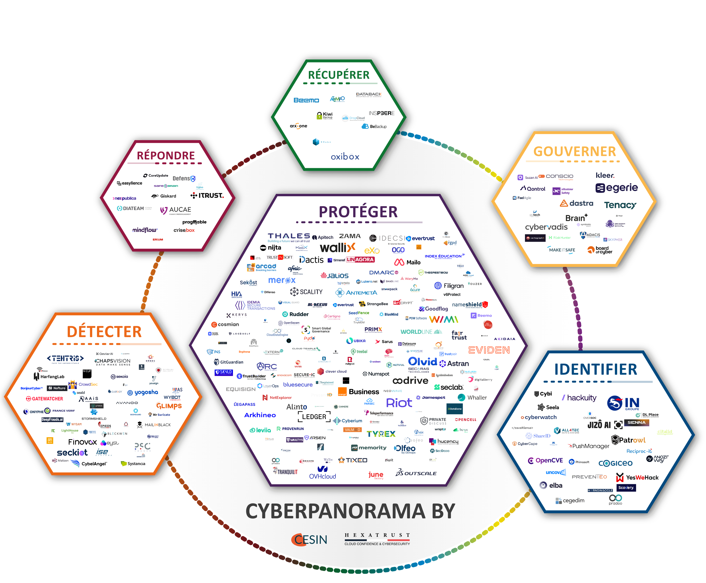

# Panorama des Solutions de Cybersécurité Souveraines
*Un projet mené en collaboration avec le [CESIN](https://www.cesin.fr) et [Hexatrust](https://www.hexatrust.com)*

<div align="center">

## 🚀 Gérer les Entreprises du panorama

[](../../issues/new?assignees=&labels=radar%3Anew-entry&template=add_company.yml)
[](../../issues/new?assignees=&labels=radar%3Aedit-entry&template=edit_company.yml)

</div>

---

## 📊 Aperçu du Panorama



---

## 📌 Contexte et objectifs

### Pourquoi ce panorama ?
- **Enjeu stratégique** : La cybersécurité est un pilier de la souveraineté numérique, surtout dans un contexte de tensions géopolitiques et de dépendances technologiques.
- **Besoins identifiés** :
  - Cartographier les solutions **françaises** pour réduire la dépendance aux acteurs extra-territoriaux.
  - Faciliter le choix des entreprises et administrations en quête de solutions **fiables et souveraines**.
  - Promouvoir l’écosystème **français** de la cybersécurité.

### Objectifs
- **Identifier** les solutions souveraines par fonction NIST (basé sur le [NIST CSF v2](https://www.nist.gov/cyberframework)).
- **Classer** leur maturité, conformité et adéquation aux besoins.
- **Promouvoir** les acteurs locaux pour renforcer leur visibilité.

---

## 🛠 Méthodologie

### Cadre de référence : NIST CSF v2 (version française)
Le **NIST Cybersecurity Framework v2** est structuré autour de **6 fonctions** :

| Fonction       | Description                                                                 |
|----------------|-----------------------------------------------------------------------------|
| **Gouverner**  | Intégrer la cybersécurité dans la gouvernance globale.                     |
| **Identifier** | Comprendre et gérer les risques liés aux systèmes, actifs et données.      |
| **Protéger**   | Mettre en place des sauvegardes pour limiter l’impact des incidents.        |
| **Détecter**   | Identifier les événements de sécurité en temps réel.                       |
| **Répondre**   | Réagir efficacement aux incidents détectés.                                |
| **Récupérer**  | Restaurer les capacités et services après un incident.                    |

*Source : [NIST](https://www.nist.gov/cyberframework)/[ANSSI](https://www.ssi.gouv.fr)*

### Critères de souveraineté
Pour être considérée comme "souveraine", une solution doit :
- **Localiser les données** en France.
- **Être soumise au droit français** (RGPD, NIS2).
- **Maîtriser ses briques technologiques** (pas de dépendance extra-européenne).
- **Garantir la transparence** (accès aux codes sources, audits).

## 🔧 Fonctionnement

### 🤖 Automatisation Complète via GitHub Actions

Ce projet utilise **GitHub Actions** pour automatiser complètement l'ajout d'entreprises et la régénération du Panorama. **Aucune exécution locale n'est nécessaire** pour l'utilisation normale.

### 🔄 Régénération Automatique

Le Panorama est régénéré automatiquement dans les cas suivants :

1. **Ajout d'entreprise approuvée** : Après validation d'une issue GitHub
2. **Modification du fichier Excel** : Quand `assets/solutions.xlsx` est modifié
3. **Modification des logos** : Quand des logos dans `assets/logos/` sont modifiés
4. **Quotidien** : Tous les jours à 2h (UTC) pour assurer la cohérence
5. **Manuel** : Via l'onglet Actions → "Run workflow"

## 📦 Installation (Développeurs uniquement)

L'installation locale n'est nécessaire que pour les développeurs souhaitant modifier le code ou générer le Panorama localement.

### 1. Cloner le dépôt

```bash
git clone https://github.com/Hexatrust/cyberpanorama
cd cyberpanorama
```

### 2. Installer les dépendances

```bash
pip install -r requirements.txt
```

### 3. Générer le Panorama localement (optionnel)

```bash
python3 src/main.py
```

Cette commande génère les fichiers SVG et PNG du Panorama.

---

## 🤝 Comment contribuer ?

### Pour les Éditeurs de Solutions

**⭐ Méthode Recommandée : Formulaire GitHub (100% automatique)**

#### Option 1 : Ajouter une nouvelle entreprise

[](../../issues/new?assignees=&labels=radar%3Anew-entry&template=add_company.yml)

**Comment ça marche ?**

1. **📝 Cliquez sur le bouton** pour ouvrir le formulaire d'ajout
2. **✍️ Remplissez les informations** :
   - Nom de l'entreprise/solution
   - Fonction NIST (Identifier, Protéger, Détecter, Répondre, Récupérer, Gouverner)
   - Sous-fonctions NIST CSF 2.0 (optionnel, max 3 catégories)
   - Objectif NIS2 principal (optionnel)
   - Taille de l'entreprise (0-Very Large, 1-Large, 2-Medium, 3-Small)
   - Description de la solution
   - **🖼️ URL du logo** (lien direct accessible publiquement)
   - Critères de souveraineté

3. **🚀 Soumettez** : Votre demande est créée automatiquement

4. **🔍 Validation** : L'équipe CESIN/Hexatrust examine (3-5 jours)

5. **✨ Ajout automatique** : Une fois approuvée, GitHub Actions :
   - ✅ Télécharge le logo automatiquement
   - ✅ Ajoute l'entreprise au fichier Excel
   - ✅ Régénère le Panorama (SVG + PNG)
   - ✅ Commit et push automatique
   - ✅ Vous notifie sur l'issue

#### Option 2 : Modifier une entreprise existante

[](../../issues/new?assignees=&labels=radar%3Aedit-entry&template=edit_company.yml)

**Quand l'utiliser ?**

- Mettre à jour le logo de votre entreprise
- Modifier la fonction NIST principale
- Changer la taille de l'entreprise
- Mettre à jour la description ou le site web

**Processus :**

1. **📝 Ouvrez le formulaire** de modification
2. **🔍 Indiquez le nom exact** de l'entreprise à modifier
3. **✏️ Remplissez uniquement** les champs que vous souhaitez modifier
4. **💬 Expliquez** la raison de la modification
5. **🚀 Validation automatique** une fois approuvée

**🎯 Processus 100% automatisé, vous n'avez rien d'autre à faire !**

---

**Méthode Alternative : Modification Manuelle**

Pour les développeurs souhaitant modifier directement les fichiers :

1. Clonez le repository
2. Modifiez `assets/solutions.xlsx` et ajoutez les logos dans `assets/logos/`
3. Testez localement : `python3 src/main.py`
4. Committez et poussez vers `main`
5. Le Panorama sera automatiquement régénéré par GitHub Actions

---

### Pour les Utilisateurs

- **💬 Retours d'expérience** : Partagez vos retours via une [Issue GitHub](../../issues/new)
- **🔧 Ajustements** : Proposez des modifications sur les solutions identifiées
- **🐛 Bugs** : Signalez les problèmes techniques


---

## 📩 Contact
- **CESIN** : [contact@cesin.fr](mailto:contact@cesin.fr)
- **Hexatrust** : [contact@hexatrust.com](mailto:contact@hexatrust.com)

---

## 📄 Licence

Ce projet est open-source, sous licence EUPL (European Union Public Licence) version 1.2. Consultez le fichier LICENSE.md pour plus de détails.

---

**Développé avec ❤️ par l'équipe du Cyberpanorama (EY France / CESIN / Hexatrust)**
